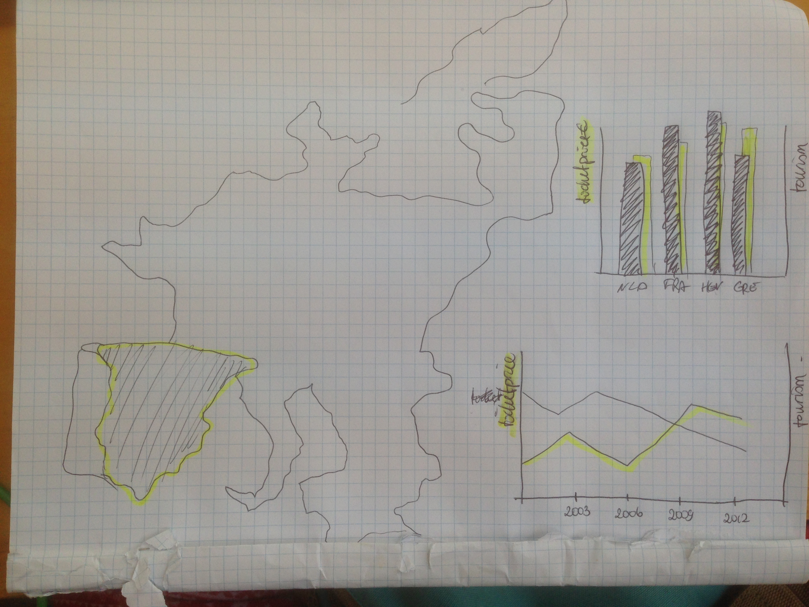

Eindproject Minor Programmeren door Wander van de Ven
======================================================================================================================
Toerisme en haar oorzaken.
--------------------------------------------------------------------------------------------------------
### Problem definition
> Bij mijn Econometristen studievereniging is het mogelijk onderzoek te doen > voor instellingen mbv data. Zo heeft een van mijn beste vrienden onderzoek > gedaan voor het Rijksmuseum. Hij onderzocht:
> Vanuit welke landen er hoeveel toeristen naar Nederland komen 
> - Hoeveel % per land daarvan naar het Rijksmuseum komen 
> - Welk afkomsten blijkbaar nog getarget moeten worden door het 
> Rijksmuseum

> Dit wekte mijn interesse over het onderwerp Toerisme als geheel. Want wie > komen er nu eigenlijk naar Nederland en belangrijker: wie komen er niet? 
> Liggen er niet heel veel kansen voor Nederland in landen waaruit men wel 
> veel naar Belgie gaat, maar niet naar Nederland? Of zijn er een aantal 
> oorzaken van toeristenstromen die dit bepalen die wij niet kunnen 
> veranderen?

> Onder 3 visualisaties zijn er drie mogelijke oorzaken die mij interessant 
> lijken te onderzoeken. 
> Gaat men vooral op vakantie in omliggende landen?
> Of kiest men er juist voor om op vakantie te gaan naar landen waar 
> ticketprijzen laag zijn? 
> Of gaat men op vakantie naar landen uit dezelfde taalfamilie. Zodanig dat 
> men iig in het land verstaanbaar is: Romaanse taal, Germaanse taal, etc.
> 
> Dit wil ik graag op de hele wereld betrekken.
>
> Om deze 3 vragen te beantwoorden wil ik graag 
> 1. een wereldmap maken:
> Hierin kan men met kleurcontrasten zien (donkere kleur bij hoger aantal) 
> vanuit welke landen toeristen komen. 
> 2. Ik wil graag een barchart maken met random 5 afkomsten en hun 
> bijbehorende ticketprijzen van die landen. Om zo te zien of deze verband 
> houden: zullen landen met lagere ticketprijzen eerder besluiten de destinatie > te kiezen.
> Eveneens wil ik op het de wereldkaart mogelijk maken om landen met 
> dezelfde taalfamilie te markeren en de 10 goedkoopste ticketprijzen een 
> popup te geven.
> 3. als derde visualisatie wil ik het mogelijk maken om de toeristenstromen 
> over 2003, 2006, 2009 en 2012 en de ticketprijzen in een lijngrafiek af te 
> zetten.
>
> ## Visualisaties(MVP):
> - Interactive map met kleurcontrast naar hoogte van toeristenstroom#
> - Barchart met ticketprijzen en toeristenstroom#
> - LineChart met toeristenstromen en ticketprijzen over de jaren
> 
> ## Interactie(MVP):
> - Interactieve map is verbonden met barchart (onclick) per land
> - hoover over land geeft aantal toeristen (hoover)
> - Interactieve map is verbonden met linechart (onclick) per land
> - Bar & LijnChart geven aantallen bij hover.
> - >
> ## Mogelijke extra features/interactie:
> - markering van zelfde taalfamilie
> - Map geeft pop-up bij 10 goedkoopste ‘ticket-landen’
> - Mogelijke extra feature is kijken of koopkracht van invloed is op >toeristenstromen.
> 
> ## Technical problems/limitations:	
> 
> - Goedkoopste Ticketprijzen opzoeken voor alle landen is hopelijk reeds 
>  eerder gedaan. Deze dienen namelijk op hetzelfde tijdstip in incognito 
>  browser verkregen te zijn. In alle andere gevallen worden ticketprijzen 
>  duurder naarmate 1 IP-adres (mijn adres in dit geval) achtereenvolgend 
> naar tickets zoekt. De data is dan onbruikbaar.
> - Beschikbaarheid toeristenstromen over de wereld.
> 
> ## De databronnen:
> 
> - toeristenstromen:	WorldBank
> - ticketprijzen:		SkyScanner
> - koopkrachtquota:	Wikipedia
> - conflicten:		ANP/Nieuwsberichten
>
> ## Schets:
> 
> Zie 
> 
> 
