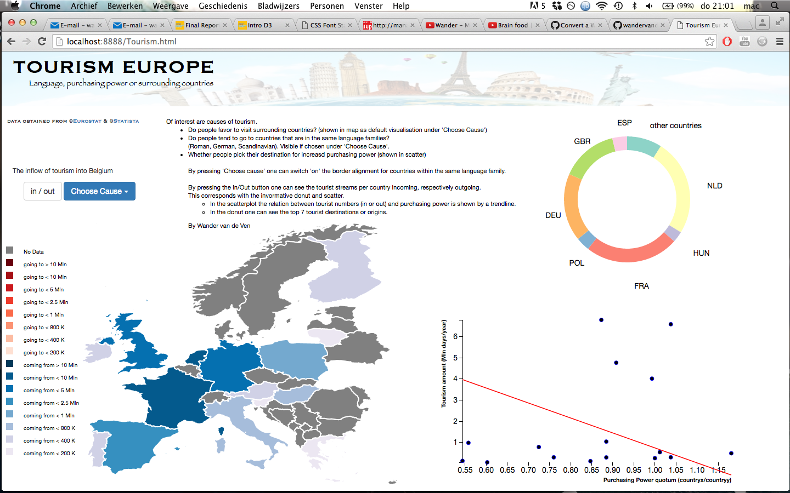
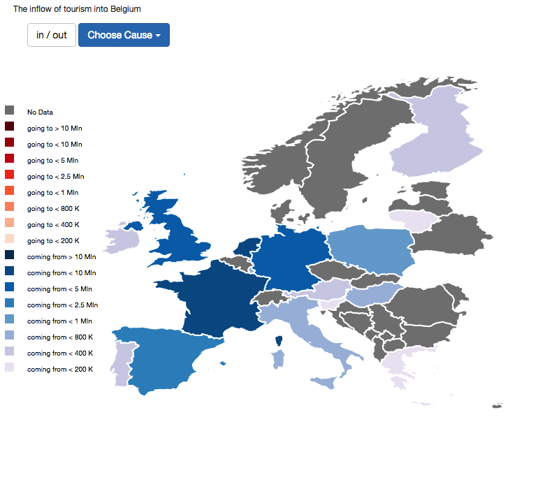
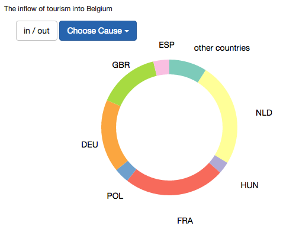
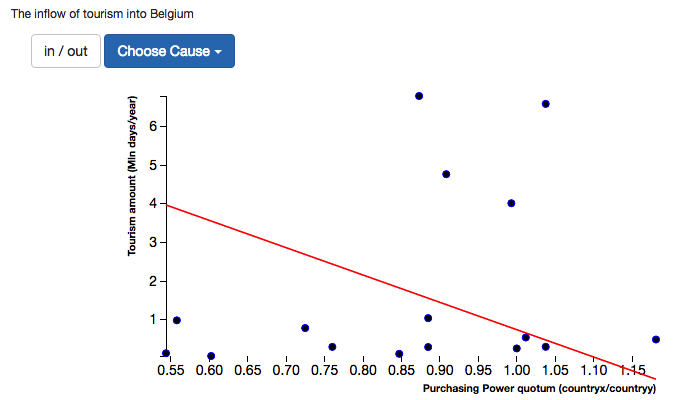

Eindproject Minor Programmeren door Wander van de Ven
=====================================================================================
Toerisme en haar oorzaken.
-----------------------------------------------------------------------------------
> 
### Descriptie
In 3 visualisaties wordt getracht een aantal hypotethische oorzaken mbt toerisme te verifiëren, namelijk:
- reist men af naar landen waar hun koopkracht het meest wordt vergroot
- bezoekt men vooral omringende landen
verblijft men graag in landen waar men nagenoeg dezelfde taal spreekt (zelfde taalfamilie)
>
Er zijn 3 visualisaties:
- De map van Europa, waarin door de 'In/Uit' button de instroom van toerisme danwel uitstroom van toerisme
van een geselecteerd land (door erop te klikken) wordt weergegeven. Landen worden ingekleurd; des te donkerder des te hoger
het aantal.
>
- De corresponderende Donut (rechtsboven) geeft de 7 grootste instroom lande nen hun relatieve mate weer. In het geval van uistroom
geeft het weer naar welke 7 landen een bepaald land het meest zijn nachten besteedt en in welk mate. 
>
- De corresponderende scatter geeft mbv een trendlijn het verband tussen toerisme en verschil in koopkracht weer. 
> ### Visualisaties
> 
> Ten eerste de wereldkaart 
> Als uitgangspositie uiteraard een visualisatie van toeristenstromen. Per geselecteerd land kan in de 'default' visualisatie van de 
> wereldkaart bekeken worden in welke mate elk Europees land naar een geselecteerd land afreist. Namelijk, hoeveel nachten worden er per > land in dit land overnacht. Standaard is Belgie gekozen en zodoende wordt Europa gekleurd, in de mate waarin elk land hun nachten in 
> Belgie verblijft. Komen er veel toeristen uit een bepaald land, dan wordt dit land relatief donker van kleur.
> 
> Door de muis op een Europees land te houden, bijvoorbeeld Oostenrijk, wordt in een pop-up het aantal nachten dat Oostenrijk in Belgie 
> overnacht weergegeven.
> Deze instroom van toerisme wordt gegeven door de blauwe kleur.
> Op click kan voor elk Europees land deze instroom worden opgevraagd, de kaart kleur zich daarop vanzelf. Voorbeeld: wordt er 
> op Frankrijk geklikt, dan ziet men de mate van toerisme vanuit alle verschillende landen van Europa door mate van donkerte in de kleur
> blauw.
> Vanuit deze visualisatie kan men opmaken vanuit waar men naar het desbetreffende land gaat. De eerste hypothese kan 
> hiermee getoetst worden: komt toerisme vooral uit omringende landen?
>
> 
> Corresponderend met de Europese kaart worden er 2 extra beschrijvende visualisaties gemaakt:
> - De PieChart geeft de 7 grootste toeristen-origine en hun relatieve aandeel weer.
> 
> - De ScatterPlot geeft het verband tussen koopkrachtquotum en toerisme.
> Met deze ScatterPlot kan de tweede hypothese getoetst worden: kiest men hun bestemming door een impuls in koopkracht? In Polen kan 
> een Nederlander een hoop meer kopen dan in Zwitserland.
>
> Zoals te zien in de linkerbovenhoek zijn er twee knoppen. 
>
> - 'In/Uit' --> Hiermee kan ervoor gekozen worden te visualiseren waar, Nederlanders bijvoorbeeld, op vakantie gaan i.p.v. te
> zien wie er naar Nederland komen. Oftewel de uitstroom van toerisme vanuit Nederland naar andere Europese landen. Alle functies 
> van de kaart blijven hetzelfde. De Scattterplot en PieChart bewegen beschrijvend mee. De PieChart geeft nu de uitstroom ipv instroom weer. De ScatterPlot geeft nu het verschil in koopkracht tussen Nederland en elk Europees land (waar data van is). Door nogmaals op de button te drukken wordt weer de instroom van toerisme per geselecteerd aangegeven.
> 
> - 'Choose Cause' --> Hiermee kan gekozen worden om de landsgrenzen op taalfamilie te kleuren. Een taalfamilie is bijv. Romaans; 
> Italie, Frankrijk, Spanje, Portugal en Roemenie, alle spreken ze de Romaanse taal. Deze landen krijgen nu dezelfde kleur landgrens. 
>
> Ik heb een aantal flinke challenges moeten doorstaan. 
> - Het zoeken naar data over toerisme op wereldschaal was niet vindbaar. Dit bleek uiteindelijk alleen voor Europa en Maleisië vindbaar.
Zodoende heb ik ervoor gekozen alleen de Europa te visualiseren en slechts en alleen de stromen binnen Europa als data te gebruiken.
>
> - Het verkrijgen van de ticket data was ondoenlijk. Het vinden van de goedkoopste tickets per land (soms wel 20 verschillende vertrekkende luchthavens) en (20 verschillende aankomst luchthavens) bleek niet haalbaar. (later meer)
>
> - Vervolgens het structuren van data in csv: per rijen. Om vervolgens om te zetten in het juiste json format.
>
> - Nadat bleek dat er geen toerisme data op wereldschaal te vinden was moest ik op zoek naar een kaart van Europa. Na veel gezoek bleek dat deze niet bestond, maar dat hiervoor een speciale projectiefunctie in Datamap zelf voor aan te roepen viel. Met de juiste 'center', 'rotatie' en 'schaal'-waarden kon zo op Europa ingezoomd worden. (hierdoor doen zich later nog meer complicaties voor)
>
> - Omdat Europa niet mooi met Datamaps te visualiseren viel heb ik eerst besloten een svg te downloaden. Twee dagen later werd geopperd dat Datamaps een hoge resolutie map online had staan waarna de visualisatie een stuk mooier gemaakt kon worden. 
>
> - Doordat ik bootstrap gebruik voor mijn buttons overschreef deze mijn CSS. Headers waren onbruikbaar en zodoende moest ik met 
 tekst schrijven die dan elk een eigen id kregen.
>
> - Om borders om mijn landen te tekenen moest ik de datamap opnieuw aanmaken. Echter, zodoende was mijn click-button buiten werking komen te staan. Deze gebruikte namelijk 'updateChoropleth' wat slechts en alleen binnen de newDatamap functie te gebruiken is. De click button moest in mijn newDatamap komen te staan. Echter, 'BEL' kan hierdoor nooit goed gevisualiseerd worden. Slechts bij aanmaken van de map wordt inkomend toerisme zichtbaar. Daarna kan meer 1 keer de 'In/Out' button gebruiken, hierna is deze onbruikbaar.
Ook bij kiezen voor 'taalfamilie weergave' onder 'Choose-Cause' is de 'In/Out' button maar 1 keer te gebruiken. Dit valt te verhelpen door elke keer na aanmaken van de newDatamap (bij refresh en keuze voor 'taalfamilie) een ander land dan België te selecteren.
>
> - BorderColors is niet zomaar per land aan te geven. Na veel research bleek Datamap per land-afkorting zijn omlijning te tekenen danwel default (wit) te omlijnen. Zodoende heb ik bij keuze voor de 'taalfamilie-weergave' een functie aangemaakt die een waarde returnt per land (welke omlijning, of geen omlijning) 
>
> - Doordat ik met een zoomfunctie werk ipv slechts de landen te visualiseren die bij Europa horen heb ik de datamap moeten downloaden en lokaal moeten opslaan om deze landen uit deze javascript functie handmatig te kunnen verwijderen. 
>
> - De Donut was al snel gemaakt. Echter waren sommige waarden zo klein dat de landnamen (om de donut) elkaar overlapten, of elkaar zelfs helemaal overschreven. Zodoende werd de keuze gemaakt om de grootste 7 weer te geven. 
Eerste probleem: hoe kun je objecten met daarin een library ordenen op grootte. Hiervoor moest online een functie worden gezocht. 
>
Tweede probleem: als je deze dan geordend in de donut plaatst heb je nog steeds hetzelfde probleem als in het begin, namelijk: de kleinste waarden worden als laatste naast elkaar in de donut geplaatst en de namen overschrijven elkaar weer. Zodoende werd ervoor gekozen ombeurt de grootste, kleinste, 1na grootste, 1na kleinste in de donut te plaatsen en daarvoor een functie te schrijven. 
>
Derde probleem: nu was niet meer te zien hoe groot het aandeel van deze landen in het totale toeristen-aandeel binnen Europa was. Zodoende werden de 'remaining countries' bij elkaar opgeteld en onder 'other countries' als 8ste 'slice' in de donut gestopt.
>
> - Nu elke keer opnieuw een Donut werd aangemaakt maar de svg niet verwijderd, werden deze herhaaldelijk onder elkaar geplaatst. Dit werd verholpen door de container waar deze in werd geplaatst te verwijderen. Nu werd er echter helemaal geen donut meer aangemaakt omdat er geen bestemming voor deze donut meer was. Door de svg in de container te plaatsen, maar deze nog een extra id mee te geven. Zodat later op deze id de map kon worden verwijderd, maar de container bleef bestaan.
> - Om de sferen van de visualisaties hetzelfde te houden werd ervoor gekozen de landen dezelfde kleuren te geven. Oftewel; ook met mate van donkerblauw of donker-rood. Nu deed het echter vermoeden dat de kleuren van de wereldkaart en de donut met elkaar interacteerde. Dit was echter niet zo. 

